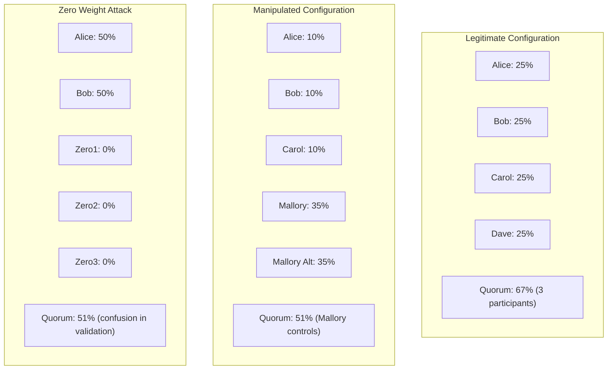
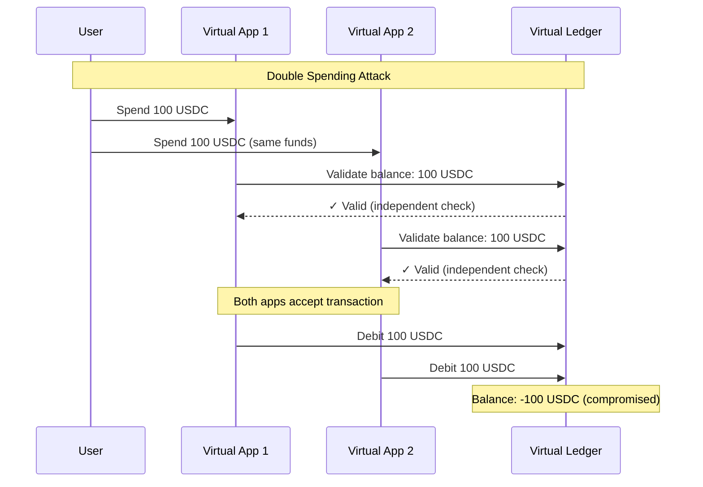
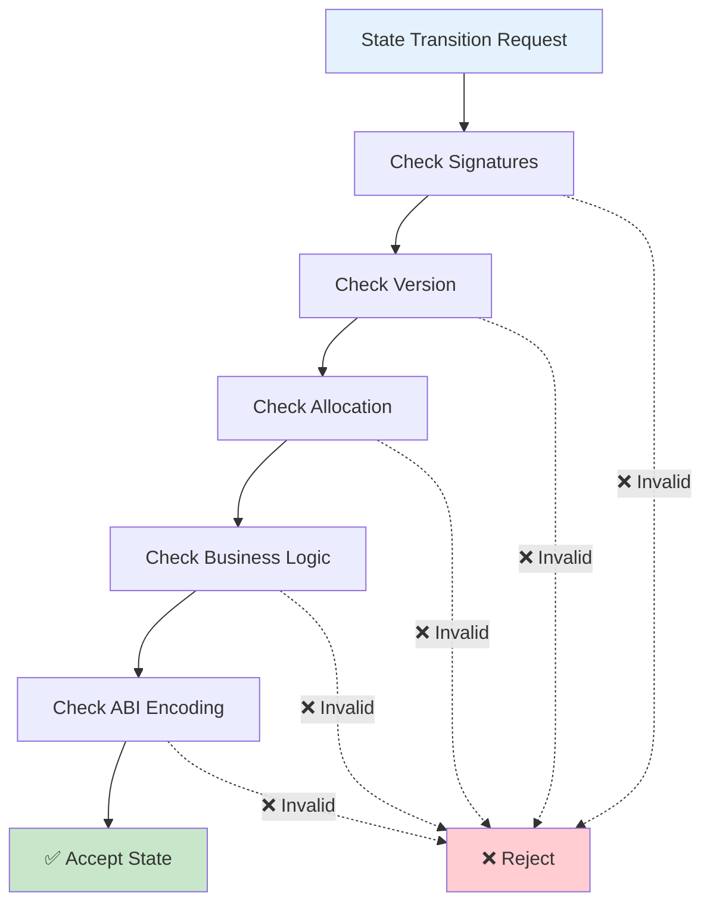
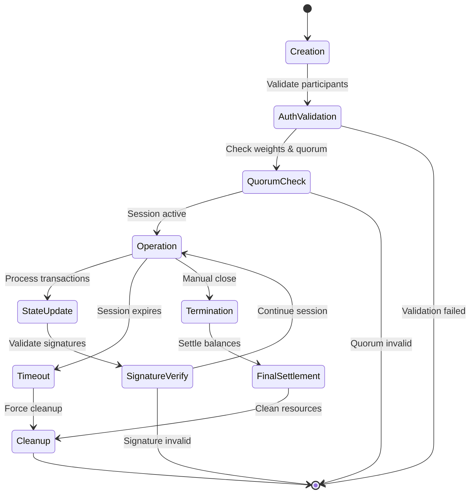

# Virtual Application Security

Security considerations and implementation patterns for developers building virtual applications on Nitrolite's virtual ledger system.

## Adjudicator Security Patterns

### Signature Validation Requirements

Virtual applications must implement robust signature validation in their adjudicators:

```solidity
contract MyGameAdjudicator is IAdjudicator {
    function adjudicate(Channel calldata chan, State calldata candidate, State[] calldata proofs)
        external view override returns (bool valid) {

        // CRITICAL: Always validate unanimous signatures for state transitions
        if (!candidate.validateUnanimousSignatures(chan)) {
            return false;
        }

        // Validate application-specific business logic
        return validateGameMove(candidate, proofs);
    }
}
```

**Common Vulnerabilities**

**The most critical vulnerability pattern in virtual application development involves inadequate signature validation. Applications that accept states without proper signature verification create immediate attack vectors for malicious actors.** This risk is compounded when developers fail to validate that all required participants have properly signed state transitions, potentially allowing unauthorized state changes.

Equally dangerous is the failure to enforce version progression in state validation, which enables signature replay attacks where previously valid signatures are reused to manipulate application state.

### State Transition Validation

Implement strict state transition logic to prevent manipulation:

```solidity
function _validateTransition(State memory previous, State memory current) internal pure returns (bool) {
    // CRITICAL: Enforce version progression
    if (current.version != previous.version + 1) {
        return false;
    }

    // CRITICAL: Validate allocation conservation
    if (!_validateAllocationConservation(previous.allocations, current.allocations)) {
        return false;
    }

    // Application-specific transition rules
    return _validateBusinessLogic(previous, current);
}
```

## Quorum-Based Consensus Vulnerabilities

### Weight Manipulation Attacks

Virtual applications use weighted quorum consensus that can be vulnerable to manipulation:

```go
// Vulnerable: Accepting weight configurations without validation
type VirtualApp struct {
    Participants []string `json:"participants"`
    Weights      []uint64 `json:"weights"`      // Potential manipulation vector
    Quorum       uint64   `json:"quorum"`       // Must validate against total weights
}
```

**Attack Vectors**

**Weight manipulation represents one of the most sophisticated attack vectors against quorum-based consensus systems. Malicious actors may attempt to assign disproportionate weights to compromised participants, effectively granting themselves outsized control over consensus decisions.** This is often combined with quorum threshold bypass attacks, where the required consensus threshold is deliberately set lower than the combined weight of honest participants.



A particularly subtle attack involves including participants with zero weight to dilute consensus calculations. While these participants cannot directly influence voting outcomes, they can be used to manipulate quorum calculations and create confusion in consensus validation logic.

**Mitigation Patterns:**
```go
func validateQuorumConfiguration(participants []string, weights []uint64, quorum uint64) error {
    if len(participants) != len(weights) {
        return fmt.Errorf("participants and weights length mismatch")
    }

    totalWeight := uint64(0)
    for _, weight := range weights {
        if weight == 0 {
            return fmt.Errorf("zero weights not allowed")
        }
        totalWeight += weight
    }

    // Require supermajority for security
    minQuorum := (totalWeight * 2) / 3 + 1
    if quorum < minQuorum {
        return fmt.Errorf("quorum too low: %d, minimum: %d", quorum, minQuorum)
    }

    return nil
}
```

### Consensus Bypassing

ClearNode validates consensus but applications must implement additional checks:

```go
// In virtual application handler
if totalWeight < int64(appSession.Quorum) {
    return fmt.Errorf("quorum not met: %d / %d", totalWeight, appSession.Quorum)
}
```

**Security Requirements**

Robust quorum-based consensus requires careful attention to signature weight aggregation, ensuring that weights from valid signatures are correctly summed and verified against participant configurations. **The system must implement strict threshold enforcement, automatically rejecting any state transitions that fail to meet established quorum requirements.**

Participant validation forms a critical component of security, requiring verification that all signers are legitimate participants with correctly assigned weights. This validation must occur before any consensus calculations to prevent unauthorized participants from influencing application state.

## Fund Isolation and Balance Security

### Virtual Ledger Manipulation

Virtual applications create isolated accounting contexts that can be vulnerable:

```sql
-- Virtual app accounts use session IDs as account identifiers
INSERT INTO ledger_entries (account_id, wallet, asset_symbol, credit, debit)
VALUES ('session_abc123', 'participant_wallet', 'USDC', 0, 100.0);
```

**Attack Vectors**

**Double spending attacks represent the most direct threat, where malicious participants attempt to spend the same funds simultaneously across multiple virtual applications.** This is particularly dangerous in systems where balance validation occurs independently within each application context.



Balance inflation attacks exploit weaknesses in double-entry accounting implementations, where attackers create credits without corresponding debits, effectively creating funds from nothing. Cross-session leakage represents a more sophisticated attack where participants gain unauthorized access to funds from virtual applications they should not be able to access.

**Security Implementation:**
```go
func (vl *VirtualLedger) TransferFunds(from, to, asset string, amount decimal.Decimal) error {
    return vl.db.Transaction(func(tx *gorm.DB) error {
        // CRITICAL: Atomic balance validation and transfer
        fromBalance, err := vl.GetBalance(from, asset)
        if err != nil {
            return err
        }

        if fromBalance.LessThan(amount) {
            return fmt.Errorf("insufficient balance: %s < %s", fromBalance, amount)
        }

        // CRITICAL: Atomic debit/credit operations
        if err := vl.RecordTransaction(from, asset, amount.Neg(), tx); err != nil {
            return err
        }

        return vl.RecordTransaction(to, asset, amount, tx)
    })
}
```

### Session Isolation Enforcement

Ensure virtual applications cannot access funds from other sessions:

```go
func validateSessionAccess(sessionID string, participantWallet string, appSession *AppSession) error {
    // CRITICAL: Verify participant is authorized for this session
    for _, participant := range appSession.ParticipantWallets {
        if participant == participantWallet {
            return nil
        }
    }
    return fmt.Errorf("unauthorized access to session %s", sessionID)
}
```

## Application State Validation

### Business Logic Security

Implement comprehensive validation for application-specific state transitions:

```solidity
contract TicTacToeAdjudicator is IAdjudicator {
    struct GameState {
        uint8[9] board;      // 0=empty, 1=player1, 2=player2
        uint8 currentPlayer; // 1 or 2
        bool gameEnded;
    }

    function adjudicate(Channel calldata chan, State calldata candidate, State[] calldata proofs)
        external view override returns (bool valid) {

        if (proofs.length != 1) return false;

        GameState memory prevGame = abi.decode(proofs[0].data, (GameState));
        GameState memory currGame = abi.decode(candidate.data, (GameState));

        // CRITICAL: Validate turn order
        if (currGame.currentPlayer == prevGame.currentPlayer) {
            return false; // Same player cannot move twice
        }

        // CRITICAL: Validate single move
        uint8 moveCount = 0;
        for (uint i = 0; i < 9; i++) {
            if (prevGame.board[i] != currGame.board[i]) {
                if (prevGame.board[i] != 0) return false; // Cannot overwrite
                if (currGame.board[i] != prevGame.currentPlayer) return false; // Wrong player
                moveCount++;
            }
        }

        return moveCount == 1; // Exactly one move allowed
    }
}
```

### State Encoding Security

Use proper ABI encoding to prevent state manipulation:

```solidity
// GOOD: Structured encoding
struct ApplicationData {
    uint256 gameId;
    bytes32 moveHash;
    uint64 timestamp;
}

// BAD: Raw bytes that can be manipulated
// bytes applicationData;
```

## Session Management Security

### Authentication in Virtual Applications

Virtual applications inherit ClearNode's authentication but should implement additional checks:

```go
func (h *VirtualAppHandler) validateParticipant(sessionID string, walletAddress string) error {
    // CRITICAL: Verify participant is part of this virtual application
    appSession, err := h.getAppSession(sessionID)
    if err != nil {
        return err
    }

    for _, participant := range appSession.ParticipantWallets {
        if strings.EqualFold(participant, walletAddress) {
            return nil
        }
    }

    return fmt.Errorf("wallet %s not authorized for session %s", walletAddress, sessionID)
}
```

### Session Lifecycle Security

Implement proper session creation and termination:

```go
func createVirtualApplication(participants []string, weights []uint64, quorum uint64) error {
    // CRITICAL: Validate all participants have active channels with broker
    for _, participant := range participants {
        if !h.hasActiveChannel(participant) {
            return fmt.Errorf("participant %s has no active channel", participant)
        }
    }

    // CRITICAL: Validate quorum configuration
    if err := validateQuorumConfiguration(participants, weights, quorum); err != nil {
        return err
    }

    // CRITICAL: Ensure sufficient funds for virtual application
    return h.validateSufficientFunds(participants)
}
```

## Race Conditions and Atomicity

### Concurrent State Updates

Virtual applications must handle concurrent updates safely:

```go
func (vl *VirtualLedger) UpdateState(sessionID string, newState ApplicationState) error {
    // CRITICAL: Use database transactions for atomicity
    return vl.db.Transaction(func(tx *gorm.DB) error {
        // Lock session for update
        var session AppSession
        if err := tx.Clauses(clause.Locking{Strength: "UPDATE"}).
            Where("session_id = ?", sessionID).First(&session).Error; err != nil {
            return err
        }

        // Validate state version progression
        if newState.Version != session.Version + 1 {
            return fmt.Errorf("invalid version progression")
        }

        // Apply state update atomically
        session.Version = newState.Version
        return tx.Save(&session).Error
    })
}
```

### Fund Transfer Atomicity

Ensure fund transfers are atomic across multiple operations:

```go
func (vl *VirtualLedger) ExecuteMultiPartyTransfer(transfers []Transfer) error {
    return vl.db.Transaction(func(tx *gorm.DB) error {
        // CRITICAL: Validate all transfers before executing any
        for _, transfer := range transfers {
            balance, err := vl.GetBalanceInTx(transfer.From, transfer.Asset, tx)
            if err != nil {
                return err
            }
            if balance.LessThan(transfer.Amount) {
                return fmt.Errorf("insufficient balance for %s", transfer.From)
            }
        }

        // Execute all transfers atomically
        for _, transfer := range transfers {
            if err := vl.ExecuteTransferInTx(transfer, tx); err != nil {
                return err // Automatic rollback
            }
        }

        return nil
    })
}
```

## Security Guidelines for Virtual Application Developers

### Adjudicator Implementation Security

**Secure adjudicator implementation forms the foundation of virtual application security. Every state transition must undergo unanimous signature validation to ensure all required participants have authorized the change.** This validation must be coupled with strict version progression enforcement, where each new state version must exactly equal the previous version plus one, preventing both replay attacks and state manipulation.



Allocation conservation represents a critical financial security requirement, ensuring that the total value within the system remains constant across state transitions. Application-specific business logic validation must be implemented comprehensively to prevent manipulation of game rules or payment conditions. All state data should utilize structured ABI encoding to prevent ambiguity and ensure deterministic serialization across different implementations.

### Quorum Configuration Security

Proper quorum configuration requires meticulous validation of participant and weight configurations. The system must verify that participant counts exactly match weight counts to prevent configuration errors that could compromise consensus. **Zero or negative weights must be explicitly rejected, as they can be exploited to manipulate consensus calculations or create undefined behavior.**

Minimum quorum thresholds should enforce supermajority requirements, typically requiring at least 67% of total weight for security-critical operations. Total weight calculations must be validated to prevent overflow conditions or mathematical errors that could compromise consensus integrity. Critical operations should implement enhanced supermajority requirements to provide additional security against coordinated attacks.

### Fund Management Security

**Financial security requires atomic database transactions for all fund operations to prevent race conditions and ensure consistency.** Every transfer operation must validate sufficient balances before execution, preventing overdraft conditions that could compromise system integrity. Session isolation must be properly implemented to prevent unauthorized access to funds from different virtual applications.

Regular auditing of virtual ledger balance calculations helps detect discrepancies or computational errors that could indicate security breaches or implementation bugs. Cross-session fund access must be prevented through strict access controls and session validation to maintain the isolation guarantees that enable secure multi-tenancy.

### Session Security Management

Participant authorization validation ensures that only legitimate users can access virtual applications they are authorized to participate in. **Session lifecycle management must be implemented comprehensively, covering creation, operation, and termination phases with appropriate security controls at each stage.**



Database locking mechanisms are essential for handling concurrent state updates safely, preventing race conditions that could lead to inconsistent state or financial discrepancies. State version progression must be validated continuously to maintain the temporal ordering that underlies the security model. Session timeout mechanisms provide protection against abandoned sessions and help prevent resource exhaustion attacks.

### Business Logic Security

**Application-specific validation must encompass all possible state transitions according to the defined rules of the virtual application.** Turn-based applications require special consideration to prevent players from taking multiple consecutive actions or skipping opponents' turns. Comprehensive validation prevents illegal moves or state manipulations that could compromise fair play or financial integrity.

Deterministic state encoding ensures that all participants interpret application state identically, preventing disputes arising from encoding ambiguities. Game and application termination conditions must be properly implemented to ensure clean resource cleanup and final settlement of participant balances.

---

These security guidelines provide a comprehensive framework for developing secure virtual applications on Nitrolite. For practical implementation examples demonstrating these principles, examine the [Consensus](https://github.com/erc7824/nitrolite/blob/main/contract/src/adjudicators/Consensus.sol) and [Remittance](https://github.com/erc7824/nitrolite/blob/main/contract/src/adjudicators/Remittance.sol) adjudicators in the Nitrolite repository.
