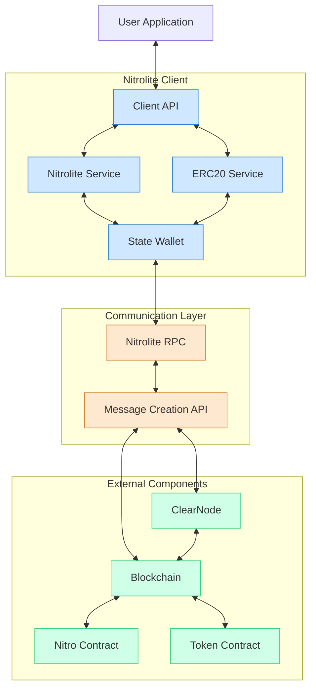

import { Card, CardGrid } from '@site/src/components/Card';

# NitroliteClient

The `NitroliteClient` class is the main entry point for interacting with Nitrolite state channels. It provides a comprehensive set of methods for managing channels, deposits, and funds.

<div align="center">

</div>

<CardGrid cols={2}>
  <Card
    title="Methods"
    description="Complete API reference organized by channel lifecycle"
    to="./methods"
  />
  <Card
    title="Type Definitions"
    description="Detailed type definitions used in the SDK"
    to="./types"
  />
  <Card
    title="Abstract Accounts"
    description="Using transaction preparation with Account Abstraction"
    to="./advanced/abstract-accounts"
  />
</CardGrid>


## Quick Start

```typescript
import { NitroliteClient } from '@erc7824/nitrolite';

// Initialize client
const nitroliteClient = new NitroliteClient({
  publicClient,
  walletClient,
  addresses: {
    custody: '0x...',
    adjudicator: '0x...',
    guestAddress: '0x...',
    tokenAddress: '0x...'
  },
  challengeDuration: 100n
});

// 1. Deposit funds
const depositTxHash = await nitroliteClient.deposit(1000000n);

// 2. Create a channel
const { channelId, initialState, txHash } = await nitroliteClient.createChannel({
  initialAllocationAmounts: [700000n, 300000n],
  stateData: '0x1234'
});

// 3. Resize the channel when needed
const resizeTxHash = await nitroliteClient.resizeChannel({
  channelId,
  candidateState: updatedState
});

// 4. Close the channel
const closeTxHash = await nitroliteClient.closeChannel({
  finalState: {
    channelId,
    stateData: '0x5678',
    allocations: newAllocations,
    version: 5n,
    serverSignature: signature
  }
});

// 5. Withdraw funds
const withdrawTxHash = await nitroliteClient.withdrawal(800000n);
```

{/* ## Learning Path

<CardGrid cols={3}>
  <Card
    title="Initializing the Client"
    description="Learn how to set up the NitroliteClient"
    to="../learn/initializing_client"
  />
  <Card
    title="Deposit Funds"
    description="Deposit ETH or tokens into the contract"
    to="../learn/connection_wallet"
  />
  <Card
    title="Creating a Channel"
    description="Guide to creating state channels"
    to="../learn/creating_channel"
  />
  <Card
    title="Channel Balances"
    description="Monitor and manage channel funds"
    to="../learn/channel_balances"
  />
  <Card
    title="Closing a Channel"
    description="Properly close channels and settle balances"
    to="../learn/close_channel"
  />
  <Card
    title="Withdrawal"
    description="Withdraw funds back to your wallet"
    to="../learn/withdrawal"
  />
</CardGrid> */}
