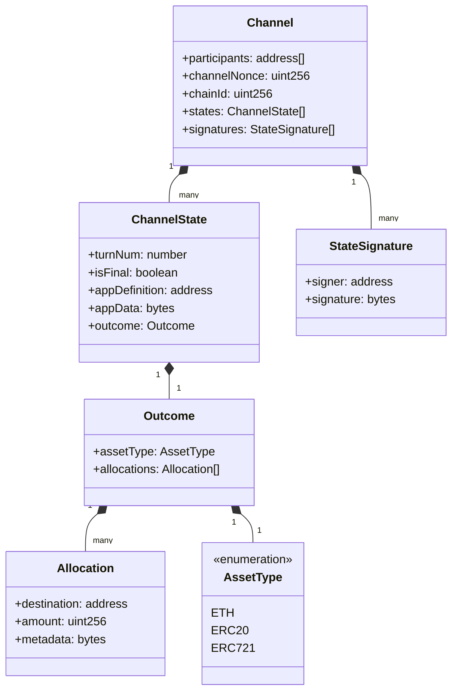

# Type Definitions

This page documents the core types used throughout the `@erc7824/nitrolite` SDK. Understanding these types is essential for effectively working with the `NitroliteClient`.

<div align="center">

</div>

## Core Types

### ChannelId

```typescript
type ChannelId = Hex;
```

A unique identifier for a state channel, represented as a hexadecimal string.

### StateHash

```typescript
type StateHash = Hex;
```

A hash of a channel state, represented as a hexadecimal string.

### Signature

```typescript
interface Signature {
  v: number;  // Recovery value
  r: Hex;     // First 32 bytes of the signature
  s: Hex;     // Second 32 bytes of the signature
}
```

Represents a cryptographic signature used for signing state channel states.

### Allocation

```typescript
interface Allocation {
  destination: Address;  // Where funds are sent on channel closure
  token: Address;        // [ERC-20](https://eips.ethereum.org/EIPS/eip-20) token address (zero address for ETH)
  amount: bigint;        // Token amount allocated
}
```

Represents the allocation of funds to a particular destination.

### Channel

```typescript
interface Channel {
  participants: [Address, Address];  // List of participants [Host, Guest]
  adjudicator: Address;              // Address of the contract that validates states
  challenge: bigint;                 // Duration in seconds for challenge period
  nonce: bigint;                     // Unique per channel with same participants and adjudicator
}
```

Represents the core configuration of a state channel.

### StateIntent

```typescript
enum StateIntent {
  OPERATE,     // Operate the state application
  INITIALIZE,  // Initial funding state
  RESIZE,      // Resize state
  FINALIZE,    // Final closing state
}
```

Indicates the intent of a state update. The intent determines how the state is processed by the channel participants and the blockchain.

### State

```typescript
interface State {
  intent: StateIntent;                 // Intent of the state
  version: bigint;                     // Version number, incremented for each update
  data: Hex;                           // Application data encoded as hex
  allocations: [Allocation, Allocation]; // Asset allocation for each participant
  sigs: Signature[];                   // State hash signatures
}
```

Represents a complete state channel state, including allocations and signatures.

## Configuration Types

### NitroliteClientConfig

```typescript
interface NitroliteClientConfig {
  // Required: viem PublicClient for reading blockchain data
  publicClient: PublicClient;

  // Required: viem WalletClient for sending transactions and account context
  walletClient: WalletClient<Transport, Chain, ParseAccount<Account>>;

  // Optional: Separate wallet client for signing states
  stateWalletClient?: WalletClient<Transport, Chain, ParseAccount<Account>>;

  // Required: Contract addresses
  addresses: ContractAddresses;

  // Required: Challenge duration in seconds
  challengeDuration?: bigint;
}
```

Configuration for initializing the `NitroliteClient`.

### ContractAddresses

```typescript
interface ContractAddresses {
  custody: Address;      // Custody contract address
  adjudicator: Address;  // Adjudicator contract address
  guestAddress: Address; // Guest participant address
  tokenAddress: Address; // Token address (zero address for ETH)
}
```

Addresses of contracts used by the Nitrolite SDK.

## Channel Lifecycle Parameter Types

### 1. Deposit Phase

Deposit operations primarily use simple `bigint` parameters for amounts.

### 2. Channel Creation

```typescript
interface CreateChannelParams {
  initialAllocationAmounts: [bigint, bigint];  // Initial allocation for [host, guest]
  stateData?: Hex;                            // Application-specific data
}
```

Parameters for creating a new channel.

### 3. Channel Operations

```typescript
interface CheckpointChannelParams {
  channelId: ChannelId;        // Channel ID to checkpoint
  candidateState: State;       // State to checkpoint
  proofStates?: State[];       // Optional proof states
}

interface ChallengeChannelParams {
  channelId: ChannelId;        // Channel ID to challenge
  candidateState: State;       // State to submit as a challenge
  proofStates?: State[];       // Optional proof states
}

interface ResizeChannelParams {
  channelId: ChannelId;        // Channel ID to resize
  candidateState: State;       // State with new allocations
  proofStates?: State[];       // Optional proof states
}
```

Parameters for channel operations.

### 4. Channel Closing

```typescript
interface CloseChannelParams {
  stateData?: Hex;  // Optional application data for the final state
  finalState: {
    channelId: ChannelId;                   // Channel ID to close
    stateData: Hex;                         // Application-specific data
    allocations: [Allocation, Allocation];  // Final allocations
    version: bigint;                        // State version
    serverSignature: Signature;             // Server's signature on the state
  };
}
```

Parameters for collaboratively closing a channel.

## Return Types

### AccountInfo

```typescript
interface AccountInfo {
  available: bigint;     // Available funds in the custody contract
  locked: bigint;        // Funds locked in channels
  channelCount: bigint;  // Number of channels
}
```

Information about an account's funds in the custody contract.

### PreparedTransaction

```typescript
type PreparedTransaction = {
  to: Address;        // Target contract address
  data?: Hex;         // Contract call data
  value?: bigint;     // ETH value to send
};
```

Represents the data needed to construct a transaction, used by the transaction preparer for Account Abstraction.

## Type Usage By Channel Lifecycle Phase

### 1. Deposit Phase

```typescript
// Deposit
await client.deposit(amount: bigint): Promise<Hash>

// Check token details
const balance: bigint = await client.getTokenBalance()
const allowance: bigint = await client.getTokenAllowance()
```

### 2. Channel Creation Phase

```typescript
// Create channel
const result: {
  channelId: ChannelId;
  initialState: State;
  txHash: Hash
} = await client.createChannel({
  initialAllocationAmounts: [bigint, bigint],
  stateData: Hex
})
```

### 3. Channel Operation Phase

```typescript
// Resize
await client.resizeChannel({
  channelId: ChannelId,
  candidateState: State
}): Promise<Hash>

// State is structured as:
const state: State = {
  intent: StateIntent.RESIZE,
  version: 2n, // Incremented from previous
  data: '0x1234',
  allocations: [
    { destination: addr1, token: tokenAddr, amount: 600000n },
    { destination: addr2, token: tokenAddr, amount: 400000n }
  ],
  sigs: [signature1, signature2]
}
```

### 4. Channel Closing Phase

```typescript
// Close
await client.closeChannel({
  finalState: {
    channelId: ChannelId,
    stateData: Hex,
    allocations: [Allocation, Allocation],
    version: bigint,
    serverSignature: Signature
  }
}): Promise<Hash>
```

### 5. Withdrawal Phase

```typescript
// Withdraw
await client.withdrawal(amount: bigint): Promise<Hash>
```

## State Intent Lifecycle

The `StateIntent` enum value determines how a state is interpreted:

1. `StateIntent.INITIALIZE`: Used when creating a channel, defines the initial funding allocations
2. `StateIntent.OPERATE`: Used during normal operations, for application-specific state updates
3. `StateIntent.RESIZE`: Used when changing allocation amounts, e.g., adding funds to a channel
4. `StateIntent.FINALIZE`: Used when closing a channel, defines the final allocations

Example of state progression:

```typescript
// 1. Initial state (on channel creation)
const initialState = {
  intent: StateIntent.INITIALIZE,
  version: 0n,
  data: '0x1234',
  allocations: [
    { destination: userAddr, token: tokenAddr, amount: 700000n },
    { destination: guestAddr, token: tokenAddr, amount: 300000n }
  ],
  sigs: [userSig, guestSig]
};

// 2. Operation state (during application usage)
const operationalState = {
  intent: StateIntent.OPERATE,
  version: 1n,  // Incremented
  data: '0x5678',  // Application data changed
  allocations: [
    { destination: userAddr, token: tokenAddr, amount: 650000n },  // Balance changed
    { destination: guestAddr, token: tokenAddr, amount: 350000n }  // Balance changed
  ],
  sigs: [userSig, guestSig]
};

// 3. Resize state (adding funds)
const resizeState = {
  intent: StateIntent.RESIZE,
  version: 2n,
  data: '0x5678',
  allocations: [
    { destination: userAddr, token: tokenAddr, amount: 950000n },  // Added funds
    { destination: guestAddr, token: tokenAddr, amount: 450000n }  // Added funds
  ],
  sigs: [userSig, guestSig]
};

// 4. Final state (closing channel)
const finalState = {
  intent: StateIntent.FINALIZE,
  version: 3n,
  data: '0x9ABC',
  allocations: [
    { destination: userAddr, token: tokenAddr, amount: 930000n },
    { destination: guestAddr, token: tokenAddr, amount: 470000n }
  ],
  sigs: [userSig, guestSig]
};
```
