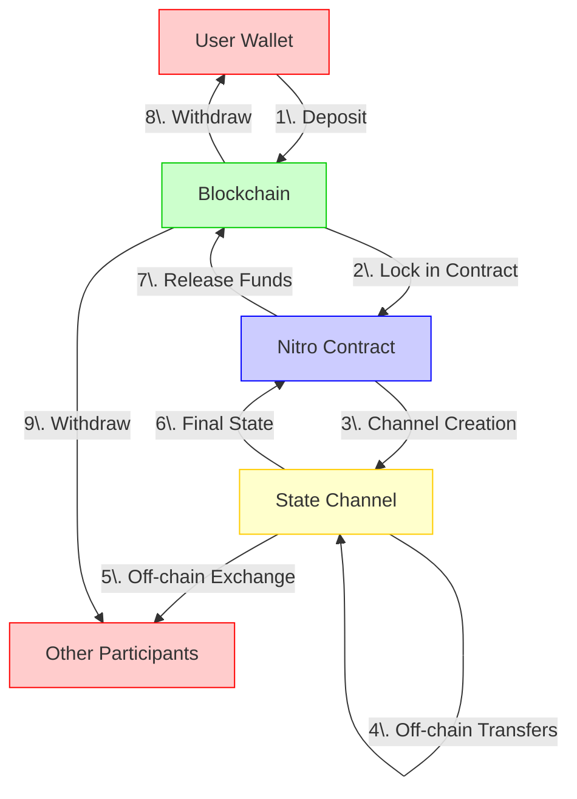

import Tabs from '@theme/Tabs';
import TabItem from '@theme/TabItem';

# Deposit And Create Channel

Creating a state channel involves depositing funds into a smart contract and establishing the channel parameters. This guide walks through the complete process of depositing USDC and creating a functional state channel.

<div align="center">

</div>

## Understanding State Channels in Nitrolite

A state channel is a secure off-chain communication pathway between two participants:

1. **Your Application** (User/App Server): The initiating participant who will use the channel for your application
2. **ClearNode**: The counterparty that facilitates off-chain transaction processing and verification

In Nitrolite, state channels are created with the following properties:

- Channels require on-chain deposits (USDC tokens)
- All participants must agree to channel terms
- Channel creation requires gas fees
- Funds are locked in the contract until the channel is closed

> **Important**: Nitrolite only supports ERC20 tokens like USDC. Native tokens like ETH are not directly supported.

## Step 1: Prepare for Channel Creation

Before creating a channel, ensure that:

1. Your client is properly initialized and connected to a wallet
2. You have sufficient ETH for gas fees
3. You have USDC tokens to deposit into the channel
4. You have the ClearNode address that will act as your counterparty

```javascript
// Check USDC balance before proceeding
const usdcBalance = await client.getTokenBalance();
console.log('Available USDC balance:', usdcBalance);

// Define channel participants
const participants = [
  client.account.address, // Your address (from connected wallet)
  client.addresses.guestAddress, // ClearNode address (from client config)
];
```

## Step 2: Deposit USDC Tokens

Before creating a channel, you need to deposit USDC tokens to the custody contract:

<Tabs>
  <TabItem value="separate" label="One-Step Process">

```javascript
// Step 1: Approve USDC tokens for deposit
// Note: In Nitrolite, approval is handled automatically by the deposit function if needed
const depositAmount = 100000000n; // 100 USDC (with 6 decimals)

// Step 2: Deposit USDC into the custody contract
try {
  const depositTx = await client.deposit(depositAmount);
  console.log('Deposit transaction submitted:', depositTx);

  // The deposit function waits for transaction confirmation internally
  console.log('USDC tokens successfully deposited to custody contract');
} catch (error) {
  console.error('Deposit failed:', error.message);
}
```

  </TabItem>
  <TabItem value="manual" label="Manual Approval">

```javascript
// If you want more control over the approval process:
try {
  // 1. Check current allowance
  const currentAllowance = await client.getTokenAllowance();
  console.log('Current USDC allowance:', currentAllowance);

  // 2. Approve USDC if needed
  if (currentAllowance < depositAmount) {
    const approvalTx = await client.approveTokens(depositAmount);
    console.log('Approval transaction submitted:', approvalTx);
    // Wait for approval to be confirmed
    // (typically you would wait for the transaction to be mined)
  }

  // 3. Deposit USDC
  const depositTx = await client.deposit(depositAmount);
  console.log('Deposit transaction submitted:', depositTx);
} catch (error) {
  console.error('Approval or deposit failed:', error.message);
}
```

  </TabItem>
</Tabs>

## Step 3: Create the Channel

After depositing USDC, you can create a channel between your application and the ClearNode:

```javascript
// Define channel parameters
const channelParams = {
  participants: participants, // [your address, ClearNode address]
  amounts: [depositAmount, 0n], // Initial allocation (you: 100 USDC, ClearNode: 0)
  tokenAddress: client.addresses.tokenAddress, // USDC token address (from client config)
  challengePeriod: client.challengeDuration, // Use default from client config
  nonce: BigInt(Date.now()), // Unique channel identifier
};

try {
  // Create the channel
  const { channelId, initialState, txHash } = await client.createChannel(channelParams);

  console.log('Channel created with ID:', channelId);
  console.log('Initial state:', initialState);
  console.log('Transaction hash:', txHash);
} catch (error) {
  console.error('Channel creation failed:', error.message);
}
```

## Step 4: Verify Channel Creation

After creating the channel, verify that it exists and is properly funded:

```javascript
// Get the list of channels associated with your account
const myChannels = await client.getAccountChannels();
console.log('My channels:', myChannels);

// Get account information including deposits and locked amounts
const accountInfo = await client.getAccountInfo();
console.log('Account info:', accountInfo);
// This shows:
// - availableAmount: USDC available for withdrawal or new channels
// - channelCount: Number of active channels
```

## Combined Process: Deposit and Create Channel

Nitrolite provides a convenient method to perform both operations in a single call:

```javascript
// Deposit USDC and create channel in one operation
const depositAmount = 100000000n; // 100 USDC (6 decimals)

const channelParams = {
  participants: [
    client.account.address, // Your address (from connected wallet)
    client.addresses.guestAddress, // ClearNode address (from client config)
  ],
  amounts: [depositAmount, 0n], // Initial allocation
  tokenAddress: client.addresses.tokenAddress, // USDC token address
  challengePeriod: client.challengeDuration, // Use default from client config
  nonce: BigInt(Date.now()), // Unique channel identifier
};

try {
  const {
    channelId,
    initialState,
    depositTxHash,
    createChannelTxHash
  } = await client.depositAndCreateChannel(depositAmount, channelParams);

  console.log('USDC deposited with transaction:', depositTxHash);
  console.log('Channel created with ID:', channelId);
  console.log('Channel creation transaction:', createChannelTxHash);
} catch (error) {
  console.error('Deposit and channel creation failed:', error.message);
}
```

## Channel Parameters Explained

When creating a channel, here's what each parameter means:

| Parameter | Description |
|-----------|-------------|
| `participants` | Array containing your address and the ClearNode address |
| `amounts` | Initial fund allocation for each participant (typically all funds start with you) |
| `tokenAddress` | Address of the USDC token contract (defined in client config) |
| `challengePeriod` | Time window (in seconds) for resolving disputes before settlement |
| `nonce` | Unique identifier to prevent replay attacks (typically current timestamp) |

## Best Practices

- **Fund Allocation**: Initially allocate all funds to your side for maximum flexibility
- **Challenge Period**: Use a reasonable period (e.g., 24 hours) to allow time for responding to challenges
- **Error Handling**: Implement proper error handling as deposit and channel creation may fail for various reasons
- **Gas Management**: Ensure you have enough ETH for gas fees, especially during network congestion
- **Transaction Monitoring**: Monitor transaction status, particularly for deposit approval

## Next Steps

After creating your channel, you can:

1. [Connect to a ClearNode](connect_to_the_clearnode) for off-chain messaging
2. [View channel assets](balances) to monitor your funds
3. [Create an application session](application_session) to start transacting

For advanced channel operations, see the [Resize Channel](resize_channel) guide.
